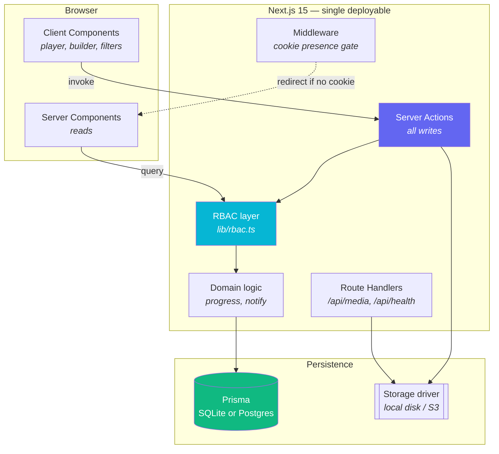

<div align="center">

# Lumina LMS

**A lightweight, fully customizable learning management system for internal organizational training.**

Udemy-style course experience — catalog, video player, quizzes, progress tracking, reviews, Q&A, certificates — scoped for a company's own people, with the compliance and reporting features an internal L&D team actually needs.

Built with Next.js 15 · TypeScript · Prisma · Tailwind CSS 4 · Neumorphic design system

</div>

---

## Contents

- [What this is](#what-this-is)
- [Quick start](#quick-start)
- [Demo accounts](#demo-accounts)
- [Feature tour](#feature-tour)
- [Architecture](#architecture)
- [Customization](#customization)
- [Deployment](#deployment)
- [Scaling](#scaling)
- [Project structure](#project-structure)
- [Commands](#commands)
- [Security notes](#security-notes)
- [Roadmap](#roadmap)

---

## What this is

Most LMS products are either enterprise suites that take a quarter to configure, or course marketplaces built around selling to strangers. Lumina is neither. It's the Udemy *learning experience* — which people already know how to use — pointed inward at your own staff, with the marketplace machinery replaced by the things internal training actually needs: required-training assignments with due dates, department-level completion reporting, and learning paths that sequence courses into onboarding tracks.

It is deliberately small. One deployable app, one database, no message broker, no search cluster, no separate media service. `docker compose up` and it runs.

**Design intent.** The interface is neumorphic — soft extruded surfaces lit from a single consistent direction, with an accent gradient reserved for the one high-emphasis action on any screen. It's implemented as two CSS utilities (`.neu` raised, `.neu-inset` pressed) over a token set that swaps cleanly between light and dark. Both themes are hand-tuned; dark mode is not an inversion, because dark neumorphism needs a lifted base for the highlight to read at all.

---

## Quick start

Requires **Node.js 20+**. No database server needed — SQLite is the default.

```bash
git clone https://github.com/turbocode99/lumina-lms.git
```

```bash
cd lumina-lms && npm install
```

Create your `.env` from the template:

```bash
cp .env.example .env
```

Generate a session secret and paste it into `.env` as `AUTH_SECRET`:

```bash
openssl rand -base64 32
```

Set up the database and load the demo dataset:

```bash
npm run setup
```

Start the dev server:

```bash
npm run dev
```

Open <http://localhost:3000>.

> **Starting from empty instead?** Skip the seed (`npm run db:push` only). The first account to register is automatically made an administrator, so you can set up a real organization without touching the database.

---

## Demo accounts

`npm run setup` seeds eight courses, three learning paths, ten people, and a spread of enrollment states so every dashboard view has something in it.

| Email | Role | What you'll see |
|---|---|---|
| `admin@example.com` | Admin | Org analytics, user management, required-training assignment |
| `instructor@example.com` | Instructor | Course builder, curriculum editor, quiz authoring |
| `learner@example.com` | Learner | Catalog, player, progress, certificates, overdue assignment |

Password for all seeded accounts: `Password123!`

---

## Feature tour

### For learners

| | |
|---|---|
| **Dashboard** | Greeting, overall progress ring, in-progress courses, required training with due-date urgency, popular-at-your-org recommendations |
| **Catalog** | Full-text search across titles, subtitles, descriptions, tags, and instructor names; filter by category, level, and required-only; five sort orders; paginated. All filter state lives in the URL, so every view is linkable |
| **Course page** | Objectives checklist, description, requirements, target audience, instructor bio, curriculum accordion with preview lessons unlocked, ratings distribution, Q&A |
| **Player** | Custom video chrome — scrubber with buffer indicator, ±10s skip, playback speed, volume, fullscreen, keyboard shortcuts (`space`/`k`, `j`/`l`, `←`/`→`, `m`, `f`). Watch position is reported every 15s and the lesson auto-completes past a configurable threshold |
| **Lesson types** | Video, article (markdown-ish prose), auto-graded quiz, downloadable resource |
| **Quizzes** | Single-choice, multi-select, and true/false. Graded server-side — the answer key never reaches the browser before submission. Configurable pass mark, attempt limits, and per-question explanations revealed after grading |
| **Notes** | Per-lesson private notes |
| **Q&A** | Threaded discussion per course and per lesson, with instructor badges and notifications |
| **Reviews** | 1–5 stars with optional comment, restricted to enrolled learners, one per person, editable |
| **Learning paths** | Ordered course tracks with a connected step rail; enrolling in a path enrolls you in every course it contains |
| **Certificates** | Auto-issued on completion, with a unique verification serial and a print/PDF stylesheet |
| **Notifications** | In-app feed for assignments, due dates, answers, reviews, and certificates |

### For instructors

- **Course builder** — outline, objectives, requirements, audience, tags, category, level, language
- **Curriculum editor** — sections and lessons with reordering, inline editing, collapse/expand
- **Quiz authoring** — question types, per-option correctness, points, explanations
- **Uploads** — video, thumbnails, and resources through a pluggable storage driver; or paste an external URL if media already lives on an internal CDN
- **Publish workflow** — draft → published → archived, with a guard against publishing an empty course
- **Per-course analytics** — enrollments, completions, ratings, run time

### For administrators

- **Org overview** — headline metrics, enrollments by category (donut), completion by department (grouped bars), most-enrolled courses, live activity feed
- **People** — create accounts, change roles, set department and title, deactivate leavers, reset passwords. Guards prevent removing your own admin role or deactivating the last active administrator
- **Course moderation** — publish, archive, or edit any course regardless of author
- **Categories** — name, colour, and icon, driving catalog chips and chart colours
- **Learning paths** — build and sequence tracks, publish/unpublish
- **Required training** — assign a course or path to any set of people filtered by department, with a due date and note. Assigning also enrolls, so it appears in My Learning immediately. Register view shows open, due-soon, overdue, and completed, with a one-click reminder blast

---

## Architecture



**Reads go through server components; writes go through server actions.** There is no REST or GraphQL layer to keep in sync — the only route handlers are media streaming (which needs HTTP range requests for video seeking) and the health probe.

**Authorization has exactly one home.** Every server component and every server action calls into `src/lib/rbac.ts`. Middleware only checks whether a session cookie *exists*, so an unauthenticated visitor never renders an authenticated shell; the real decision always happens where the database is reachable. A role change or deactivation therefore takes effect on the very next request, not when the token expires.

**Sessions are a signed JWT in an httpOnly cookie.** No session table, no external auth service, no extra container. The token carries a user id and a role snapshot, but every render re-reads the user row.

**Denormalised counters, single writer.** `Enrollment.progressPercent`, `Course.ratingAvg`, `Course.lessonCount`, and friends are cached so the catalog and dashboard render without walking every lesson row. `src/lib/progress.ts` is the only thing that writes them, and it cascades: lesson completion → course progress → path progress → assignment closure → certificate issuance → notification.

**Portable schema.** No native enums, no array columns, no provider-specific types. Values that would be enums are strings validated against `src/lib/enums.ts`; values that would be arrays are JSON strings read through `src/lib/json.ts`. Switching SQLite → PostgreSQL is one line.

---

## Customization

### One file for branding and features

`lumina.config.ts` is the single place to re-skin and re-scope the platform.

```ts
export const luminaConfig: LuminaConfig = {
  brand: {
    name: "Lumina",
    tagline: "Learning, elevated.",
    organization: "Your Organization",
    certificateAuthority: "Learning & Development",
  },

  theme: {
    accent: "#6366f1",       // re-skins buttons, focus rings, charts, glows
    secondary: "#06b6d4",
    defaultMode: "system",
    depth: 9,                // neumorphic extrusion depth, in px
    radius: 20,
  },

  features: {
    learningPaths: true,
    mandatoryTraining: true,
    certificates: true,
    reviews: true,
    discussions: true,
    notes: true,
    quizzes: true,
    leaderboard: true,
    selfEnrollment: true,    // false = admin-provisioned enrollment only
  },

  learning: {
    videoCompletionThreshold: 0.9,  // watch ratio that auto-completes a lesson
    quizPassingScore: 70,
    quizMaxAttempts: 3,             // 0 = unlimited
    certificateThreshold: 100,
    dueSoonReminderDays: 7,
  },
  // …
};
```

Feature flags gate whole routes *and* their navigation entries — turning off `learningPaths` removes the sidebar item, the learner pages, and the admin console section together, and the assignment UI stops offering paths as a target.

### Theming

Colours live as CSS custom properties in `src/app/globals.css`, defined three times: on bare `:root` (light), under `@media (prefers-color-scheme: dark)` guarded by `:root:not([data-theme="light"])`, and under `:root[data-theme="dark"]` so the explicit toggle wins in both directions. Change the token, not the component.

The whole soft-UI language reduces to two utilities:

```css
.neu       { /* raised: highlight top-left, shadow bottom-right */ }
.neu-inset { /* pressed: the same shadows, inverted */ }
```

`.neu-interactive` composes them into rest → hover-lift → press-in. If you're adding a component, reach for these before writing new shadows.

### Swapping the storage backend

Implement five methods and register the driver. Nothing else changes.

```ts
// src/lib/storage/s3.ts
export class S3StorageDriver implements StorageDriver {
  readonly name = "s3";
  async put(file, { folder, originalName }) { /* … */ }
  async get(key, range) { /* … */ }   // range support keeps video seeking working
  async delete(key) { /* … */ }
  async exists(key) { /* … */ }
  url(key) { /* … */ }
}
```

```ts
// src/lib/storage/index.ts
case "s3": return new S3StorageDriver({ bucket: process.env.S3_BUCKET! });
```

Then set `STORAGE_DRIVER=s3`.

### Adding SSO

The credential flow and the session helpers are decoupled on purpose: anything that can resolve an external identity to a local user row can open a session. `src/lib/providers/oidc.ts` is a working stub with the four steps written out — register the app, add the env vars, add a callback route that verifies the ID token against the issuer's JWKS (`jose` is already a dependency), and add a button. `signInWithExternalIdentity()` handles provisioning and session creation.

---

## Deployment

### Docker Compose (recommended)

```bash
export AUTH_SECRET=$(openssl rand -base64 32)
```

```bash
docker compose up -d
```

That's the whole deployment. SQLite lives on the `lumina-data` volume and uploads on `lumina-storage`, so both survive container replacement. The image uses Next.js `standalone` output and stays under 300 MB.

Health check: `GET /api/health` — returns 200 when the process is up and the database is reachable, 503 otherwise. Wired into both the Dockerfile `HEALTHCHECK` and the Compose service.

### With PostgreSQL

Set `provider = "postgresql"` in `prisma/schema.prisma`, then:

```bash
docker compose --profile postgres up -d
```

### Bare Node

```bash
npm ci && npx prisma migrate deploy && npm run build && npm start
```

Put nginx or Caddy in front for TLS. Behind a reverse proxy, `secure` cookies require the connection to actually be HTTPS at the browser.

### Vercel / managed platforms

Works as a standard Next.js app, with one caveat: **the local storage driver needs a persistent filesystem.** Serverless platforms don't have one, so pair a managed deployment with the S3 driver and a hosted Postgres.

---

## Scaling

Sensible defaults per deployment size:

| Org size | Database | Storage | Notes |
|---|---|---|---|
| Pilot, < 100 people | SQLite | Local disk | Genuinely fine. Single volume, trivial backup |
| Up to ~500 | SQLite | Local disk | Watch write contention if many people finish lessons simultaneously |
| 500 – 5,000 | PostgreSQL | S3 / Azure Blob | Switch both; run 2+ app instances behind a load balancer |
| 5,000+ | PostgreSQL + read replica | S3 + CDN | Move video to a streaming service (Mux, Cloudflare Stream) via a storage driver |

The app is stateless once storage is external — sessions are cookie-based, so horizontal scaling needs no sticky sessions and no shared session store.

---

## Project structure

```
lumina-lms/
├── lumina.config.ts              ← branding, feature flags, learning rules
├── prisma/
│   ├── schema.prisma             ← portable data model, heavily commented
│   └── seed.ts                   ← realistic org-training dataset
├── src/
│   ├── middleware.ts             ← cookie-presence gate
│   ├── app/
│   │   ├── globals.css           ← the entire design system
│   │   ├── (auth)/               ← login, register
│   │   ├── (app)/                ← authenticated shell
│   │   │   ├── dashboard/  catalog/  courses/[slug]/
│   │   │   ├── learn/[slug]/[lessonId]/
│   │   │   ├── my-learning/  paths/  certificates/
│   │   │   ├── notifications/  profile/
│   │   │   ├── instructor/       ← builder
│   │   │   └── admin/            ← console
│   │   ├── actions/              ← auth, learning, authoring, admin
│   │   └── api/                  ← media streaming, health
│   ├── components/
│   │   ├── ui/                   ← neumorphic primitives
│   │   ├── shell/  course/  player/  instructor/  admin/
│   └── lib/
│       ├── auth.ts  rbac.ts      ← sessions and authorization
│       ├── progress.ts           ← the only writer of cached progress
│       ├── notify.ts  enums.ts  json.ts  validators.ts  utils.ts
│       ├── storage/              ← pluggable driver + local implementation
│       └── providers/oidc.ts     ← SSO stub
└── Dockerfile · docker-compose.yml · .github/workflows/ci.yml
```

---

## Commands

| Command | What it does |
|---|---|
| `npm run dev` | Dev server with hot reload |
| `npm run build` | Production build (runs `prisma generate` first) |
| `npm start` | Serve the production build |
| `npm run setup` | `generate` + `db push` + `seed` — one-shot local setup |
| `npm run db:push` | Sync schema without a migration (dev) |
| `npm run db:migrate` | Create and apply a migration |
| `npm run db:seed` | Load the demo dataset (idempotent) |
| `npm run db:studio` | Prisma Studio — browse and edit rows |
| `npm run db:reset` | Drop, recreate, reseed |
| `npm run typecheck` | `tsc --noEmit` |
| `npm run lint` | ESLint |

---

## Security notes

Worth knowing before you put this in front of real people:

- **`AUTH_SECRET` must be a real random value.** Everything about session integrity rests on it. `openssl rand -base64 32`. Never commit it.
- **Passwords are bcrypt at cost 12.** Login returns an identical error for unknown-email and wrong-password, and burns comparable time on both, so the form can't be used to enumerate accounts.
- **Quizzes are graded server-side.** `QuizOption.isCorrect` is explicitly excluded from the player's query — the answer key is not in the page source.
- **Storage keys are re-validated on every read.** Path traversal, absolute paths, and anything resolving outside the storage root are rejected before touching the filesystem.
- **Media is auth-gated.** `/api/media/*` requires a session, so lesson video isn't world-readable by URL.
- **Login redirects are same-origin only,** so the `?next=` parameter can't be turned into an open redirect.
- **Self-registration is on by default** for easy evaluation. For a real deployment, either set `AUTH_ALLOW_SELF_REGISTRATION=false` and provision from the admin console, or restrict `AUTH_ALLOWED_EMAIL_DOMAINS` to your corporate domain.
- **`robots.txt` is not the access control.** The app sets `noindex`, but the real protection is that every route requires a session.

---

## Roadmap

Deliberately out of scope for v1, in rough order of usefulness:

- SSO wired end-to-end (the provider interface is ready; the callback route is not)
- Email transport for notifications — `src/lib/notify.ts` is the single seam
- SCORM / xAPI import for existing course libraries
- Video transcripts and caption tracks
- CSV export for compliance reporting
- Gamification surface for the `leaderboard` flag that's already in config
- Scheduled reminder job (currently an admin-triggered button)

---

## License

MIT — see [LICENSE](LICENSE).
