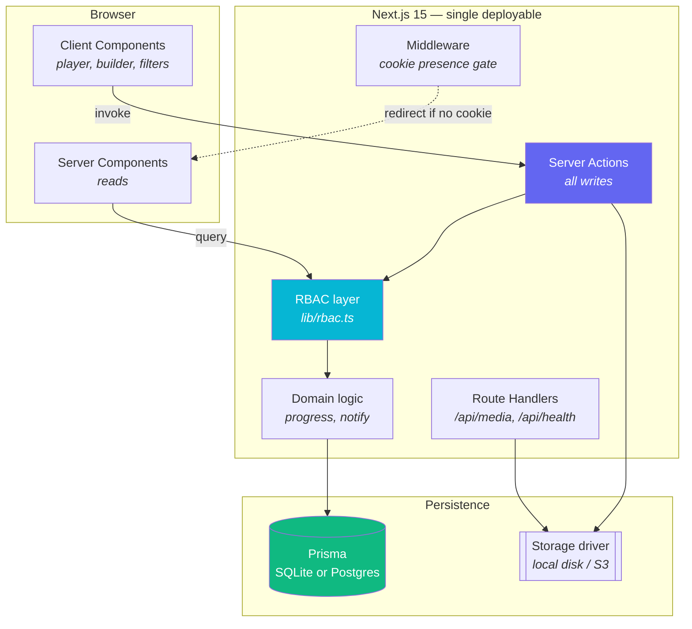

<div align="center">

# Lumina LMS

**A lightweight, fully customizable learning management system for internal organizational training.**

Udemy-style course experience — catalog, video player, quizzes, progress tracking, reviews, Q&A, certificates — scoped for a company's own people, with the compliance and reporting features an internal L&D team actually needs.

Built with Next.js 15 · TypeScript · Prisma · Tailwind CSS 4 · Neumorphic design system

</div>

---

## Contents

- [What this is](#what-this-is)
- [Quick start](#quick-start)
- [Demo accounts](#demo-accounts)
- [Feature tour](#feature-tour)
- [Architecture](#architecture)
- [Customization](#customization)
- [Deployment](#deployment)
- [Scaling](#scaling)
- [Project structure](#project-structure)
- [Commands](#commands)
- [Guided tours](#guided-tours)
- [Roles & authorization](#roles--authorization)
- [Security notes](#security-notes)
- [Roadmap](#roadmap)

---

## What this is

Most LMS products are either enterprise suites that take a quarter to configure, or course marketplaces built around selling to strangers. Lumina is neither. It's the Udemy *learning experience* — which people already know how to use — pointed inward at your own staff, with the marketplace machinery replaced by the things internal training actually needs: required-training assignments with due dates, department-level completion reporting, and learning paths that sequence courses into onboarding tracks.

It is deliberately small. One deployable app, one database, no message broker, no search cluster, no separate media service. `docker compose up` and it runs.

**Design intent.** The interface is neumorphic — soft extruded surfaces lit from a single consistent direction, with an accent gradient reserved for the one high-emphasis action on any screen. It's implemented as two CSS utilities (`.neu` raised, `.neu-inset` pressed) over a token set that swaps cleanly between light and dark. Both themes are hand-tuned; dark mode is not an inversion, because dark neumorphism needs a lifted base for the highlight to read at all.

---

## Quick start

Requires **Node.js 20+**. No database server needed — SQLite is the default.

```bash
git clone https://github.com/turbocode99/lumina-lms.git
```

```bash
cd lumina-lms && npm install
```

```bash
npm run setup
```

```bash
npm run dev
```

Open <http://localhost:4400> and sign in as `admin@example.com` / `Password123!`.

`npm run dev` and `npm start` both keep running until you stop them — if the page won't load, check the process is still alive before looking anywhere else.

The default port is **4400**, deliberately not 3000 — that one collides with Next.js, Create React App, and Rails defaults, so on a machine doing any other web work it is usually already taken. 4400 also steers clear of 4000 (Phoenix), 5000 (Flask, macOS AirPlay), 5173 (Vite), 7000 (AirPlay), 8000 (Django), and 8080.

If even 4400 is busy, both `npm run dev` and `npm start` move to the next free port and tell you which they took. Set `PORT` in `.env` or the shell to choose explicitly, or pass `--strict-port` to fail instead of moving. Port 3000 is excluded outright: request it and you get the default back with a note.

That's it — four commands, no manual file editing. `npm run setup` creates `.env` from the template, generates a real random `AUTH_SECRET`, applies the schema, and loads the demo dataset. It's safe to re-run: an existing `.env` is never overwritten, and only a placeholder secret gets replaced.

> **Want an empty instance instead of demo data?** Use `npm run setup:empty`. The first account to register is automatically made an administrator, so you can stand up a real organization without touching the database.

<details>
<summary>Prefer to do it by hand?</summary>

```bash
cp .env.example .env
```

Then generate a secret and set it as `AUTH_SECRET` in `.env`:

```bash
openssl rand -base64 32
```

```bash
npx prisma generate && npx prisma db push && npm run db:seed
```

The app refuses to start if `AUTH_SECRET` is still one of the placeholder values from the templates — every session would otherwise be forgeable by anyone who has read the source.

</details>

---

## Demo accounts

`npm run setup` seeds eight courses, three learning paths, ten people, and a spread of enrollment states so every dashboard view has something in it.

| Email | Role | What you'll see |
|---|---|---|
| `admin@example.com` | Admin | Org analytics, user management, required-training assignment |
| `instructor@example.com` | Instructor | Course builder, curriculum editor, quiz authoring |
| `learner@example.com` | Learner | Catalog, player, progress, certificates, overdue assignment |

Password for all seeded accounts: `Password123!`

---

## Feature tour

### For learners

| | |
|---|---|
| **Dashboard** | Greeting, overall progress ring, in-progress courses, required training with due-date urgency, popular-at-your-org recommendations |
| **Catalog** | Full-text search across titles, subtitles, descriptions, tags, and instructor names; filter by category, level, and required-only; five sort orders; paginated. All filter state lives in the URL, so every view is linkable |
| **Course page** | Objectives checklist, description, requirements, target audience, instructor bio, curriculum accordion with preview lessons unlocked, ratings distribution, Q&A |
| **Player** | Custom video chrome — scrubber with buffer indicator, ±10s skip, playback speed, volume, fullscreen, keyboard shortcuts (`space`/`k`, `j`/`l`, `←`/`→`, `m`, `f`). Watch position is reported every 15s and the lesson auto-completes past a configurable threshold |
| **Lesson types** | Video, article (markdown-ish prose), auto-graded quiz, downloadable resource |
| **Quizzes** | Single-choice, multi-select, and true/false. Graded server-side — the answer key never reaches the browser before submission. Configurable pass mark, attempt limits, and per-question explanations revealed after grading |
| **Notes** | Per-lesson private notes |
| **Q&A** | Threaded discussion per course and per lesson, with instructor badges and notifications |
| **Reviews** | 1–5 stars with optional comment, restricted to enrolled learners, one per person, editable |
| **Learning paths** | Ordered course tracks with a connected step rail; enrolling in a path enrolls you in every course it contains |
| **Certificates** | Auto-issued on completion, with a unique verification serial and a print/PDF stylesheet |
| **Leaderboard** | Top ten by courses completed, over a rolling 30 or 90 days or all time, with your own standing shown privately. Deliberately no full ranking |
| **Notifications** | In-app feed for assignments, due dates, answers, reviews, and certificates, with optional email for the ones carrying a deadline or a result |

### For instructors

- **Course builder** — outline, objectives, requirements, audience, tags, category, level, language
- **Curriculum editor** — sections and lessons with reordering, inline editing, collapse/expand
- **Quiz authoring** — question types, per-option correctness, points, explanations
- **Uploads** — video, thumbnails, and resources through a pluggable storage driver; or paste an external URL if media already lives on an internal CDN
- **Publish workflow** — draft → published → archived, with a guard against publishing an empty course
- **Per-course analytics** — enrollments, completions, ratings, run time

### For administrators

- **Org overview** — headline metrics, enrollments by category (donut), completion by department (grouped bars), most-enrolled courses, live activity feed
- **People** — create accounts, change roles, set department and title, deactivate leavers, reset passwords. Guards prevent removing your own admin role or deactivating the last active administrator
- **Course moderation** — publish, archive, or edit any course regardless of author
- **Categories** — name, colour, and icon, driving catalog chips and chart colours
- **Learning paths** — build and sequence tracks, publish/unpublish
- **Required training** — assign a course or path to any set of people filtered by department, with a due date and note. Assigning also enrolls, so it appears in My Learning immediately. Register view shows open, due-soon, overdue, and completed, with reminders on a one-click button or a schedule
- **CSV export** — required training, enrolments and progress, or certificates, as a spreadsheet. Exports the whole set rather than the page you are looking at, and the required-training export carries whatever filter is applied

---

## Architecture



**Reads go through server components; writes go through server actions.** There is no REST or GraphQL layer to keep in sync — the only route handlers are media streaming (which needs HTTP range requests for video seeking) and the health probe.

**Authorization has exactly one home.** Every server component and every server action calls into `src/lib/rbac.ts`. Middleware only checks whether a session cookie *exists*, so an unauthenticated visitor never renders an authenticated shell; the real decision always happens where the database is reachable. A role change or deactivation therefore takes effect on the very next request, not when the token expires.

**Sessions are a signed JWT in an httpOnly cookie.** No session table, no external auth service, no extra container. The token carries a user id and a role snapshot, but every render re-reads the user row.

**Denormalised counters, single writer.** `Enrollment.progressPercent`, `Course.ratingAvg`, `Course.lessonCount`, and friends are cached so the catalog and dashboard render without walking every lesson row. `src/lib/progress.ts` is the only thing that writes them, and it cascades: lesson completion → course progress → path progress → assignment closure → certificate issuance → notification.

**Portable schema.** No native enums, no array columns, no provider-specific types. Values that would be enums are strings validated against `src/lib/enums.ts`; values that would be arrays are JSON strings read through `src/lib/json.ts`. Switching SQLite → PostgreSQL is one line.

---

## Customization

### One file for branding and features

`lumina.config.ts` is the single place to re-skin and re-scope the platform.

```ts
export const luminaConfig: LuminaConfig = {
  brand: {
    name: "Lumina",
    tagline: "Learning, elevated.",
    organization: "Your Organization",
    certificateAuthority: "Learning & Development",
  },

  theme: {
    accent: "#6366f1",       // re-skins buttons, focus rings, charts, glows
    secondary: "#06b6d4",
    defaultMode: "system",
    depth: 9,                // neumorphic extrusion depth, in px
    radius: 20,
  },

  features: {
    learningPaths: true,
    mandatoryTraining: true,
    certificates: true,
    reviews: true,
    discussions: true,
    notes: true,
    quizzes: true,
    leaderboard: true,
    selfEnrollment: true,    // false = admin-provisioned enrollment only
  },

  learning: {
    videoCompletionThreshold: 0.9,  // watch ratio that auto-completes a lesson
    quizPassingScore: 70,
    quizMaxAttempts: 3,             // 0 = unlimited
    certificateThreshold: 100,
    dueSoonReminderDays: 7,
  },
  // …
};
```

Feature flags gate whole routes *and* their navigation entries — turning off `learningPaths` removes the sidebar item, the learner pages, and the admin console section together, and the assignment UI stops offering paths as a target.

### The leaderboard

Ranked on courses completed, with lessons completed as the tiebreaker so steady
progress through a long course still counts. The window is rolling — thirty or
ninety days back from today, or all time — rather than calendar months, which
would leave the board empty every first of the month and unbeatable by the 28th.

Two things it deliberately does not do.

It shows a top ten and stops. A complete ordering of everyone is also, read from
the bottom, a published list of who has done least, which inside a company is a
different artefact from a scoreboard. Admins who need the whole picture have the
CSV exports.

A viewer sees their own standing, and only their own, and only once they have
something on the board. Telling someone they are last is not motivating, and it
is the one thing this surface could do that nobody asked for.

Turn the whole thing off with the `leaderboard` flag: the route 404s and the sidebar
entry disappears, like every other flag.

### Theming

Colours live as CSS custom properties in `src/app/globals.css`, defined three times: on bare `:root` (light), under `@media (prefers-color-scheme: dark)` guarded by `:root:not([data-theme="light"])`, and under `:root[data-theme="dark"]` so the explicit toggle wins in both directions. Change the token, not the component.

The whole soft-UI language reduces to two utilities:

```css
.neu       { /* raised: highlight top-left, shadow bottom-right */ }
.neu-inset { /* pressed: the same shadows, inverted */ }
```

`.neu-interactive` composes them into rest → hover-lift → press-in. If you're adding a component, reach for these before writing new shadows.

### Swapping the storage backend

Implement five methods and register the driver. Nothing else changes.

```ts
// src/lib/storage/s3.ts
export class S3StorageDriver implements StorageDriver {
  readonly name = "s3";
  async put(file, { folder, originalName }) { /* … */ }
  async get(key, range) { /* … */ }   // range support keeps video seeking working
  async delete(key) { /* … */ }
  async exists(key) { /* … */ }
  url(key) { /* … */ }
}
```

```ts
// src/lib/storage/index.ts
case "s3": return new S3StorageDriver({ bucket: process.env.S3_BUCKET! });
```

Then set `STORAGE_DRIVER=s3`.

### Compliance exports

Three CSV reports, from the admin screens that already show the same data:

| Report | Where | Covers |
|---|---|---|
| Required training | Required training | Every assignment: person, department, what was assigned, status, due date, days overdue, who assigned it |
| Enrolments and progress | Organisation overview | Every enrolment with progress percent, source, and completion dates |
| Certificates | Certificates | Every certificate with its verification serial |

They are admin-only, and taking one is written to the activity log next to every
other admin action — an export carries names, emails, and departments out of the
system, so who took it is worth recording.

The screens cap their tables at 150 and 200 rows because nobody scrolls past
that, which is exactly why the exports do not inherit the cap. They read the
whole set in pages and stream the response, so a year of records does not have
to be assembled in memory first. The required-training export carries whatever
`?status=` filter the register is showing, so what you download matches what you
were looking at.

Dates are ISO 8601 to the millisecond: lossless for audit, and unreadable as
day/month in one country and month/day in another. Files open with a byte order
mark so Excel reads them as UTF-8 rather than mangling every non-ASCII name.

Values beginning `=`, `+`, `-`, or `@` are prefixed with an apostrophe. A
spreadsheet treats those as formulas, and a course titled `=HYPERLINK(...)` would
otherwise execute when an administrator opens a file they have every reason to
trust. Numbers are written as numbers and skip that guard, so a negative value
stays negative rather than turning into text.

### Scheduled reminders

Due-soon and overdue reminders can run on a schedule rather than waiting for an
admin to press the button. Set `CRON_SECRET` and point whatever already schedules
things at the endpoint:

```bash
0 8 * * *  curl -fsS -X POST https://lms.example.com/api/cron/reminders \
             -H "Authorization: Bearer $CRON_SECRET"
```

An endpoint rather than a timer inside the app, and that is the decision rather
than a shortcut. Scaling above has two or more instances behind a load balancer
from five hundred people upward; a timer in a web process would run on every one
of them, die with the process, and have nowhere to report a failure except the
log. Cron, a systemd timer, a Kubernetes CronJob, Windows Task Scheduler, or a
hosted cron service all already exist wherever this lands, and all of them can
shout when a job fails.

With no secret set the endpoint answers 503 and stays closed. An open version of
it would let anyone on the internet mail everyone with overdue training.

**Running it twice is safe, and that is the point.** The sweep *claims* rows
before sending anything: one update stamps every eligible assignment, and only
rows carrying that exact stamp are notified. A second run arriving a moment
later matches nothing. That is what lets a daily schedule coexist with two app
instances and an admin pressing the button, without anyone being reminded twice.

The same guard is what stops a daily schedule nagging: `reminderRepeatDays` in
`lumina.config.ts` (three by default) is the minimum gap between reminders for
the same assignment, so an overdue item is chased every few days rather than
every morning until it is done.

The trade-off in claiming first is that a crash between claiming and sending
costs those people one cycle rather than sending twice. For a nag that is the
right way round.

The button on the required-training screen now runs exactly this sweep, so it
honours both settings too — pressing it twice no longer sends everything twice,
which mattered little when reminders were in-app only and matters considerably
now they can be email.

### Email notifications

Off by default. Everything still reaches the in-app feed; `EMAIL_DRIVER` decides
whether anything additionally goes to an inbox.

```bash
EMAIL_DRIVER="smtp"
APP_URL="https://lms.example.com"
EMAIL_FROM="Lumina <learning@example.com>"
SMTP_HOST="smtp.example.com"
```

Port defaults to 587, TLS mode is inferred from it (465 implicit, 587 and 25
STARTTLS), and omitting `SMTP_USER`/`SMTP_PASSWORD` sends unauthenticated —
which is how most internal relays accept mail from inside the network.

`APP_URL` is what turns a notification's `/courses/x` into something clickable
from an inbox. Without it mail still goes out, with a warning and no link.

**Developing against it.** `EMAIL_DRIVER="console"` prints each message to the
server log instead of sending — the whole pipeline, nothing leaving the machine.
Worth using, given that the failure mode of this feature is mailing real staff.

**What sends.** `emailNotifications` in `lumina.config.ts`, defaulting to
`ASSIGNMENT`, `DUE_SOON`, `OVERDUE`, and `CERTIFICATE` — the four that carry a
deadline or a result. Answers, reviews, and enrolments stay in-app: a busy course
produces dozens of answers a day, and a tool that fills an inbox with things
nobody has to act on gets a mail rule written against it, at which point the
overdue-compliance mail stops landing too.

Deactivated accounts are skipped. They still get the notification row, because
the record of what was assigned matters for audit, but an offboarded person does
not get the mail.

**Where it runs.** Delivery happens after the response, via `after()` — assigning
training to a 200-person department is 200 messages, and nobody should watch a
spinner for the length of an SMTP batch. Failures are logged and swallowed: the
notification is already written and the admin's action already succeeded, so a
relay being down is not a reason to fail either.

To send through Postmark, SES, or Resend instead, implement `send` in a new file
under `src/lib/email/` and register it — same shape as the storage driver.

### Single sign-on (OIDC)

SSO is built in. Set three environment variables and the login page grows a
sign-in button; leave them unset and Lumina stays password-only, with no route,
button, or behaviour change.

```bash
OIDC_ISSUER="https://login.microsoftonline.com/<tenant-id>/v2.0"
OIDC_CLIENT_ID="..."
OIDC_CLIENT_SECRET="..."
```

Register this redirect URI with your provider:

```
https://<your-host>/api/auth/callback/oidc
```

Anything that publishes a discovery document at
`<issuer>/.well-known/openid-configuration` works — Azure AD, Okta, Google
Workspace, Keycloak, Auth0. Endpoints, signing keys, and the client
authentication method are all read from it, so there is nothing per-provider to
configure.

**Provisioning.** By default an account must already exist: someone who
authenticates successfully but has no Lumina user is turned away rather than
created. That is the stricter posture, and usually the right one, because an
IdP generally covers more people than should have access to any single internal
tool. Set `OIDC_AUTO_PROVISION="true"` to create accounts on first sign-in
instead; `OIDC_DEFAULT_ROLE` picks what they get (`LEARNER` by default), and
`AUTH_ALLOWED_EMAIL_DOMAINS` still restricts which domains may be created.
Existing accounts are never subject to the domain rule — an admin who
deliberately added a contractor on another domain should not be locked out by a
setting meant to govern self-service.

**What the flow does.** Authorization code with PKCE. Every sign-in carries a
`state` (CSRF), a `nonce` (replay), and an S256 challenge, all minted server-side
and parked in one short-lived signed cookie while the browser is at the IdP. The
returned ID token is verified against the issuer's published JWKS and checked for
the right issuer, audience, and nonce before any account is touched. A callback
that arrives without a matching transaction is rejected before the token endpoint
is called at all.

An account is matched on email. A provider that explicitly reports
`email_verified: false` is refused, since an unverified address would otherwise
be a way onto an existing account. Providers that omit the claim entirely — which
many enterprise directories do for directory-backed accounts — are accepted.

**Where the code lives.** `src/lib/providers/oidc-client.ts` is the protocol:
discovery, authorize URL, code exchange, token verification.
`src/lib/providers/oidc.ts` is the account mapping, and knows nothing about OIDC
— swapping in SAML or a header-based proxy means writing a new caller, not
editing it. The two route handlers under `src/app/api/auth/` join them up.

---

## Deployment

### On-prem VM (recommended)

**Host OS: Ubuntu Server 24.04 LTS.** Reasoning, not just a default:

- Docker's own apt repository treats Ubuntu as a first-class target, so `docker-ce` tracks upstream releases fastest here — matters more than it sounds, since the Compose file below depends on the `--profile` flag (Compose v2) and healthcheck syntax that older packaged versions lack.
- LTS means security patches to 2029 without a distribution upgrade, which is what "runs quietly for years on a VM nobody thinks about" actually requires.
- Install the **Server** image (no desktop) — it is the same kernel and package set with a couple of hundred MB less idle footprint and attack surface, and every command in this section assumes a shell, not a GUI.

Two good alternatives, if either applies to you:

- **Debian 12 (Bookworm)** — same apt/Docker-repo story as Ubuntu, a lighter base image, and an even more conservative update cadence. Pick this over Ubuntu if you would rather the OS itself changed less between now and whenever you next touch this VM.
- **Rocky Linux 9** (or AlmaLinux 9) — for teams already standardized on RHEL-family tooling (`dnf`, `firewalld`, SELinux). Binary-compatible with RHEL, no license fee. Swap `apt` for `dnf` in the install commands below; everything else is identical, since it is all inside containers regardless of host distribution.

A pilot for a few hundred people is comfortable on 2 vCPU / 4 GB RAM / 20 GB disk — see [Scaling](#scaling) for when to grow past that.

**The one command**, once Docker itself is on the box:

```bash
./deploy.sh
```

It generates `.env.docker` with a random `AUTH_SECRET` (only on the first run — re-running never rotates an existing one, since that would sign every session out), builds the image, starts the stack, and waits for `/api/health` to answer before printing the URL. Re-running after a `git pull` rebuilds and restarts in place; nothing about it is one-shot-only.

Don't have Docker yet? One line, then `./deploy.sh`:

```bash
curl -fsSL https://get.docker.com | sh
```

*(Rocky/RHEL: `sudo dnf install -y docker-ce docker-ce-cli containerd.io docker-compose-plugin && sudo systemctl enable --now docker` instead.)*

Useful flags — `./deploy.sh --help` for the full list:

| Flag | Effect |
|---|---|
| `--seed` | Load the demo dataset instead of starting empty |
| `--port 8080` | Publish on a different host port (default 4400) |
| `--org-name "Acme Inc"` | Sets the name shown in the UI |
| `--domain lms.acme.internal` | Stands up Caddy in front and gets you a real HTTPS certificate automatically (see below) |
| `--postgres` | Also start a PostgreSQL container instead of SQLite |

Without `--seed`, the instance starts empty and **the first account anyone registers becomes the administrator** — no separate bootstrap step.

**Automatic HTTPS.** Point DNS for a domain at the VM, open ports 80 and 443, then:

```bash
./deploy.sh --domain lms.example.com
```

This starts a Caddy container (see `Caddyfile`) that requests and renews a Let's Encrypt certificate on its own — no certbot, no cron job, no manual renewal, ever. Caddy validates the domain over port 80 before issuing, which is why DNS has to already be live. For an internal-only domain with no public DNS, `Caddyfile` has a one-line alternative using Caddy's own local CA instead — see the comment in that file.

This matters beyond convenience: [session cookies only carry the `Secure` flag when the connection is actually HTTPS](#security-notes), so anyone reaching the app over plain HTTP has their session cookie readable by anything on the network path. Fine for a quick look on a trusted LAN; not fine for anything anyone will actually rely on. Put TLS in front before that point, either this way or with your own reverse proxy.

**Under the hood**, `deploy.sh` is a thin wrapper — nothing it does is hidden or hard to reproduce by hand. A shell-exported variable takes precedence over the same key in `--env-file`, so this is equivalent to what the script does without needing to hand-edit `.env.docker` at all:

```bash
export AUTH_SECRET=$(openssl rand -base64 32)
docker compose --env-file .env.docker up -d --build
```

Health check: `GET /api/health` — returns 200 when the process is up and the database is reachable, 503 otherwise. Wired into both the Dockerfile `HEALTHCHECK` and the Compose service, and what `deploy.sh` polls before declaring success.

SQLite lives on the `lumina-data` volume and uploads on `lumina-storage`, so both survive container replacement — a `docker compose down && ./deploy.sh` keeps all data. The image uses Next.js `standalone` output and stays under 300 MB.

### With PostgreSQL

Set `provider = "postgresql"` in `prisma/schema.prisma`, then either `./deploy.sh --postgres` or, by hand:

```bash
docker compose --env-file .env.docker --profile postgres up -d --build
```

### Bare Node

```bash
npm ci && npx prisma db push && npm run build && npm start
```

Serves on `http://127.0.0.1:4400`, and equally on `http://localhost:4400` and `http://[::1]:4400`. Use `PORT` to change it — the launchers read it from `.env` as well as the shell, with the shell taking precedence.

`npm start` runs `scripts/serve.mjs` rather than `next start`, because `next start` does **not** work with the `output: "standalone"` build this project uses — it refuses and serves nothing. The script assembles the standalone bundle (copying `.next/static` and `public` into it, which Next.js does not do itself) and launches `server.js`. The Dockerfile performs the same copies as explicit layers.

**Bind address.** The server binds `::`, which accepts IPv6 *and* IPv4-mapped connections, so `127.0.0.1`, `localhost`, and `[::1]` all reach it whichever family the client tries first. This matters more than it sounds: with an IPv4-only `0.0.0.0` bind, `http://[::1]:4400` is refused outright and `http://localhost:4400` works only if the client retries IPv4 after the IPv6 attempt fails — so the app appears down while being perfectly healthy. Where IPv6 is disabled the launcher detects the failed bind and falls back to `0.0.0.0`, and says so. Set `HOSTNAME` to override.

**Ports.** Defaults to 4400. If that is taken, the launcher scans upward for a free one and reports the change. Where the port is part of a contract — behind a reverse proxy, say — add `--strict-port` to fail loudly instead of moving:

```bash
PORT=8080 npm start -- --strict-port
```

The single source of truth for the default is `DEFAULT_PORT` in `scripts/lib/port.mjs`. The Dockerfile, compose file, and launch config carry the same number, so change it in all four if you move it.

**Build directories.** `next.config.ts` points dev at `.next-dev` and production at `.next`. They share `.next` by default, which combined with `output: "standalone"` means a `next dev` after a `next build` reads the production artifacts and hangs at "Starting…" indefinitely — no error, no timeout. Separate directories let either command follow the other with no cleanup step.

Put nginx or Caddy in front for TLS. Behind a reverse proxy, `secure` cookies require the connection to actually be HTTPS at the browser.

### Vercel / managed platforms

Works as a standard Next.js app, with one caveat: **the local storage driver needs a persistent filesystem.** Serverless platforms don't have one, so pair a managed deployment with the S3 driver and a hosted Postgres.

---

## Scaling

Sensible defaults per deployment size:

| Org size | Database | Storage | Notes |
|---|---|---|---|
| Pilot, < 100 people | SQLite | Local disk | Genuinely fine. Single volume, trivial backup |
| Up to ~500 | SQLite | Local disk | Watch write contention if many people finish lessons simultaneously |
| 500 – 5,000 | PostgreSQL | S3 / Azure Blob | Switch both; run 2+ app instances behind a load balancer |
| 5,000+ | PostgreSQL + read replica | S3 + CDN | Move video to a streaming service (Mux, Cloudflare Stream) via a storage driver |

The app is stateless once storage is external — sessions are cookie-based, so horizontal scaling needs no sticky sessions and no shared session store.

---

## Project structure

```
lumina-lms/
├── lumina.config.ts              ← branding, feature flags, learning rules
├── prisma/
│   ├── schema.prisma             ← portable data model, heavily commented
│   └── seed.ts                   ← realistic org-training dataset
├── src/
│   ├── middleware.ts             ← cookie-presence gate
│   ├── app/
│   │   ├── globals.css           ← the entire design system
│   │   ├── (auth)/               ← login, register
│   │   ├── (app)/                ← authenticated shell
│   │   │   ├── dashboard/  catalog/  courses/[slug]/
│   │   │   ├── learn/[slug]/[lessonId]/
│   │   │   ├── my-learning/  paths/  certificates/
│   │   │   ├── notifications/  profile/
│   │   │   ├── instructor/       ← builder
│   │   │   └── admin/            ← console
│   │   ├── actions/              ← auth, learning, authoring, admin
│   │   └── api/                  ← media, health, SSO, CSV exports
│   ├── components/
│   │   ├── ui/                   ← neumorphic primitives
│   │   ├── shell/  course/  player/  instructor/  admin/
│   └── lib/
│       ├── auth.ts  rbac.ts      ← sessions and authorization
│       ├── progress.ts           ← the only writer of cached progress
│       ├── notify.ts  enums.ts  json.ts  validators.ts  utils.ts
       ├── csv.ts  reports.ts     ← compliance exports
│       ├── storage/              ← pluggable driver + local implementation
       ├── email/                ← pluggable driver + console/SMTP
│       └── providers/              ← SSO: oidc.ts maps accounts,
│                                     oidc-client.ts speaks OIDC
└── Dockerfile · docker-compose.yml · .github/workflows/ci.yml
```

---

## Commands

| Command | What it does |
|---|---|
| `npm run dev` | Dev server with hot reload. Picks a free port if yours is taken |
| `npm run build` | Production build (runs `prisma generate` first) |
| `npm start` | Serve the production build (assembles the standalone bundle first) |
| `npm run setup` | One-shot local setup: provisions `.env`, mints `AUTH_SECRET`, applies schema, seeds. Idempotent |
| `npm run setup:empty` | Same, without the demo data — first registered account becomes admin |
| `npm run set-admin` | Change an administrator's email, password, or name from the CLI |
| `npm run smoke` | End-to-end check of every route, guard, and media path against a running server |
| `npm run db:push` | Sync schema without a migration (dev) |
| `npm run db:migrate` | Create and apply a migration |
| `npm run db:seed` | Load the demo dataset (idempotent) |
| `npm run db:studio` | Prisma Studio — browse and edit rows |
| `npm run db:reset` | Drop, recreate, reseed |
| `npm run typecheck` | `tsc --noEmit` |
| `npm run lint` | ESLint |

---

## Guided tours

Every interactive screen has a short walkthrough that runs once on a user's first visit, then stays available from the **?** button in the top bar. Tours are defined in [`src/lib/tours.ts`](src/lib/tours.ts) — 11 tours, 31 steps — and matched by route and minimum role, so a learner is never walked through an admin control they cannot see.

Design choices worth knowing, since the usual failure mode of product tours is being patronising and then ignored:

- **Steps explain what labels don't.** "This is the search box" earns nothing. "Filters live in the URL, so a filtered view is a link you can share" is worth a step. Three to five steps per screen — a fourteen-step tour teaches people to skip the next one too.
- **Anchors are `data-tour` attributes on real UI**, not CSS classes or DOM structure, so restyling cannot silently break a tour. A step whose anchor is missing is dropped rather than spotlighting empty space; steps that are genuinely state-dependent are marked `optional` so an audit can tell "conditional" from "someone renamed the anchor".
- **Progress is per account, not per browser.** Stored in `TourCompletion`, so dismissing a tour on your laptop doesn't make it reappear on a shared machine — and "replay" is a real setting rather than a localStorage trick. Manage them under **Profile → Guided tours**, individually or all at once.
- **No new dependency.** The overlay is a spotlight, a positioned card, and keyboard handling; a tour library would arrive with its own theming to fight with the design tokens. Arrow keys move, Esc closes, progress dots jump.

`npm run smoke` checks that every required anchor actually renders — a renamed anchor otherwise just makes a tour quietly shorter without failing anything.

## Roles & authorization

Three hierarchical roles: **Learner → Instructor → Administrator**, each including everything below it. Administrators can see and edit the full matrix at **`/admin/roles`**, and assign roles per person at `/admin/users`.

The permission model lives in one place — [`src/lib/permissions.ts`](src/lib/permissions.ts) — and both the guards and the admin matrix are derived from it. A hand-maintained table of "what each role can do" drifts from the code the first time anyone changes a guard, and a security matrix that lies is worse than none.

| | Learner | Instructor | Administrator |
|---|---|---|---|
| Browse catalog, enrol, take courses | ✅ | ✅ | ✅ |
| Notes, reviews, Q&A | ✅ enrolled | ✅ | ✅ |
| Create and publish courses | — | ✅ own | ✅ any |
| Author quizzes, upload media | — | ✅ own | ✅ any |
| Manage people and roles | — | — | ✅ |
| Categories, paths, required training | — | — | ✅ |
| Org analytics, certificate register | — | — | ✅ |

Four properties hold this together, and each is verified rather than assumed:

- **The database decides, not the session.** The cookie carries a role, but every request re-reads the user row. A token claiming `ADMIN` for a learner account is ignored, and deactivating someone ends their access on the next request — no waiting for expiry.
- **Every write is guarded server-side.** All 40 server actions call into [`src/lib/rbac.ts`](src/lib/rbac.ts) before touching data. Hiding a button is presentation, not security.
- **Ownership is separate from role.** Instructors are limited to courses they created; only administrators act across all of them.
- **Lesson media requires a session.** Video and resources stream through an authenticated route, so a URL alone is not access.

Refusals are explicit: a blocked user lands on `/forbidden` with their role, the role required, and who to ask — rather than being bounced silently.

### Login throttling

Failed sign-ins are capped at **8 per account** and **30 per address** in a rolling **15-minute** window, counted in the database so the limit survives restarts and holds across instances. Attempts against non-existent accounts are recorded too — skipping them would turn the throttle itself into an account-existence oracle. The decision logic is isolated in [`src/lib/throttle-policy.ts`](src/lib/throttle-policy.ts) with no IO, so the limits and window arithmetic are testable directly.

## Security notes

Worth knowing before you put this in front of real people:

- **`AUTH_SECRET` must be a real random value.** Everything about session integrity rests on it. `npm run setup` generates one; otherwise use `openssl rand -base64 32`. Never commit it. The app **refuses to start** if the secret is still a template placeholder, because those strings are public and long enough to pass a naive length check — that combination would otherwise let anyone forge a session.
- **Passwords are bcrypt at cost 12.** Login returns an identical error for unknown-email and wrong-password, and burns comparable time on both, so the form can't be used to enumerate accounts. Attempts are throttled — see above.
- **`not-found` is deliberately vague.** A record that doesn't exist and one you can't see return the same page, so it can't be used to probe for hidden records.
- **Quizzes are graded server-side.** `QuizOption.isCorrect` is explicitly excluded from the player's query — the answer key is not in the page source.
- **Storage keys are re-validated on every read.** Path traversal, absolute paths, and anything resolving outside the storage root are rejected before touching the filesystem.
- **Media is auth-gated.** `/api/media/*` requires a session, so lesson video isn't world-readable by URL.
- **Login redirects are same-origin only,** so the `?next=` parameter can't be turned into an open redirect.
- **Self-registration is on by default** for easy evaluation. For a real deployment, either set `AUTH_ALLOW_SELF_REGISTRATION=false` and provision from the admin console, or restrict `AUTH_ALLOWED_EMAIL_DOMAINS` to your corporate domain.
- **`robots.txt` is not the access control.** The app sets `noindex`, but the real protection is that every route requires a session.
- **The session cookie's `Secure` flag follows the actual connection, not `NODE_ENV`.** It is set when the request arrived over HTTPS — directly, or via a proxy that says so with `X-Forwarded-Proto` — and omitted otherwise. Tying it to `NODE_ENV=production` alone would mean a production build reached over plain HTTP (a LAN address, an internal host with no TLS yet) has its cookie silently discarded by the browser: sign-in appears to work and then bounces straight back to the login form, with nothing in the logs to explain why. Serving over plain HTTP in production logs a one-time warning instead of failing mutely — see [On-prem VM](#on-prem-vm-recommended) for putting real TLS in front.

### Recovering admin access

If the admin email is wrong or nobody can sign in, there is no way to fix it through a UI that requires signing in first. With shell access:

```bash
npm run set-admin -- --email you@company.com --password 'a-real-password'
```

Add `--from old@example.com` when there is more than one administrator, and `--name 'Full Name'` to set the display name. The script only changes an existing account — it promotes it to `ADMIN` and reactivates it if needed, and never echoes the password. Existing sessions keep working, since they are signed with `AUTH_SECRET` rather than the password.

If you change the admin email, also set `SEED_ADMIN_EMAIL` in `.env`. The seed upserts on that address, so without it a reseed recreates the default admin as a *second* administrator alongside yours. `SEED_ADMIN_PASSWORD` pins the password the same way.

### Demo media

`demo-assets/` holds a generated media set — one thumbnail per seeded course, one short video per video lesson, and PDFs for the downloadable-resource lessons. `npm run db:seed` copies it into your storage directory and points the seeded records at it, so the demo library has working thumbnails, playable video, and real downloads on a fresh clone with no extra tooling.

Three things worth knowing:

- **It routes through storage, not `public/`.** Anything in `public/` is world-readable, which would quietly contradict the rule that lesson content requires a session. Copying into storage means the demo set is served by `/api/media/*` behind the same auth check as an instructor's own uploads.
- **The clips are 12 seconds, and the seeded durations say so.** Video lessons store the real length of the attached file rather than an aspirational figure, because showing "18m" next to a 12-second clip is visibly wrong and the completion threshold is a ratio of actual playback. Seeded courses therefore run 6–31 minutes rather than hours.
- **Everything is drawn from scratch** — gradients and text rendered by ffmpeg, and hand-built single-page PDFs. There is no third-party footage or imagery, and the generator is not a project dependency (it lives outside the repo, so `npm install` stays lean).

Delete `demo-assets/` if you don't want any of it; the seed reports what is missing and carries on.

### A note on relative SQLite paths

`DATABASE_URL="file:./dev.db"` is resolved by Prisma against the **schema directory**, not the working directory. That matters in two places, and both are handled:

- `npm start` rewrites a relative path to an absolute one anchored at the project's `prisma/`. Without this, the standalone bundle carries its own `prisma/` and the server reads a database frozen at build time — CLI changes invisible to the app, app writes discarded by the next build, no error anywhere.
- The container entrypoint **refuses to start** on a relative path, since it would resolve inside the image instead of the mounted volume and quietly lose everything on restart. Use an absolute path such as `file:/app/data/lumina.db` (the compose default).

---

## Roadmap

Deliberately out of scope for v1, in rough order of usefulness:

- SCORM / xAPI import for existing course libraries
- Video transcripts and caption tracks

---

## License

MIT — see [LICENSE](LICENSE).
